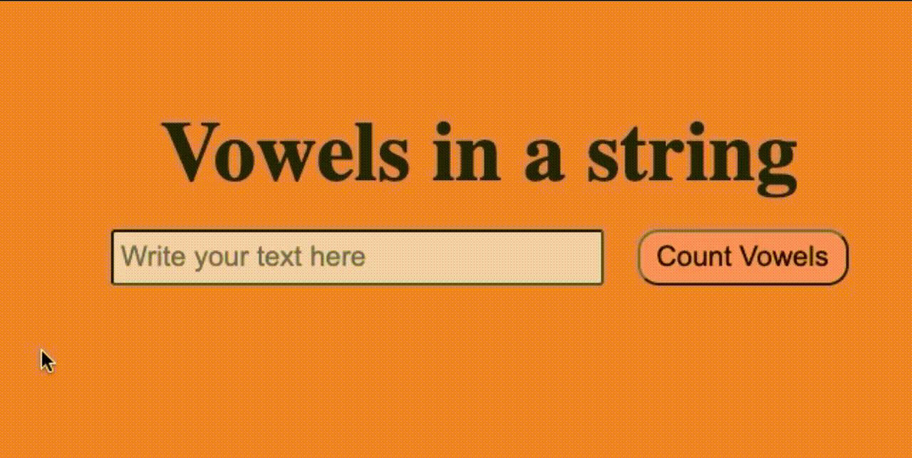

# Project : Vowels in a string Project
​
https://vowels-in-a-string.vercel.app/

## Description
​
Created a project to calculate the number of vowels in a string with Javascript.
​
## Project GIF
​

## Technologies used
​
- HTML
​
- CSS

- Javascript

## Project clone link
​
https://github.com/HilalVildan/Vowels-in-a-string.git
